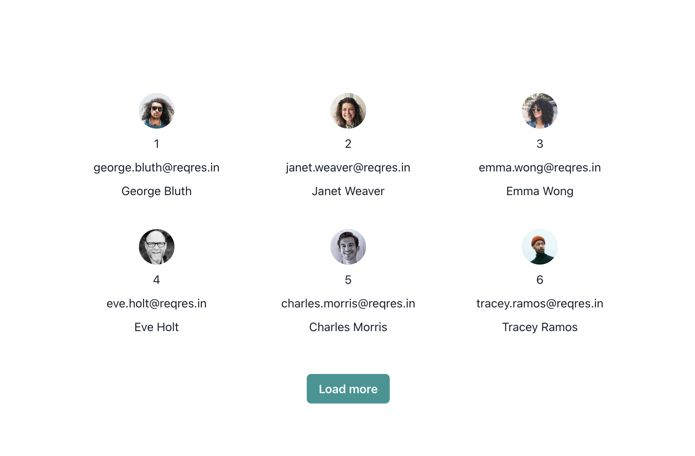
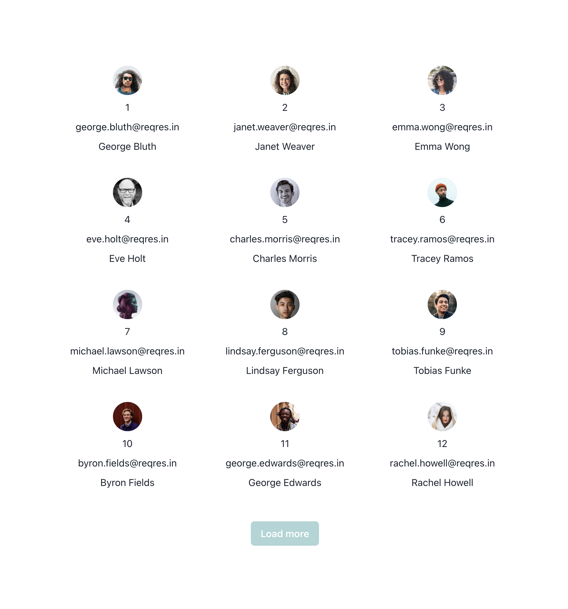

# NextJS test task

Please create a Next.js 12 or Next.js 13 project with a following page `/users`:

- The page should show a list of users
- The list has a pagination
- At the first view you should see the first 6 items
- The button: `"Load more"` should then append (not replace) the next 6 items and so on
- If there are no more items to fetch the "Load more" button should be disabled
- The list of the users should be fetched from this API:  https://reqres.in/
- Please show following props of the user:
  - id
  - email
  - first_name
  - last_name
  - avatar (as an Avatar image)
- `TypeScript` should be used as a language here
  - usage of any type is not allowed

Additional notice: The results with a good support for `SEO` and `Google Lighthouse` score are rated higher. We are testing the results with: https://pagespeed.web.dev/

The example API URL for the first page is: https://reqres.in/api/users?page=1

It's up to you how do you want to implement a user list UI. It could be a list of cards or a data table. Please show at least following fields of the user per item.

## Here is an example how that could looks like:
This is just an example of how it might look. It's up to you how the cards can look.

The  initial view:

## The second view:
After the Load more button was clicked

## Major files
- app
  - users
    - page.tsx
  - globals.css
  - page.tsx

  - components
    - LoadMore
      - index.tsx
    - UserCard
      - index.tsx
    - UsersSection
      - index.tsx
- utils
  - index.ts